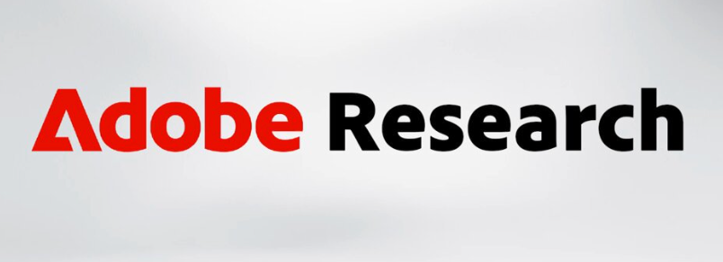
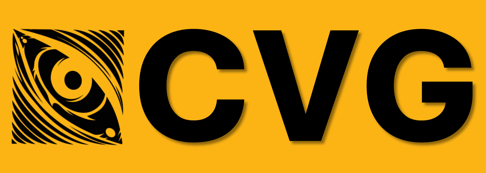

(intro)=
# Naresh Kumar Devulapally

I am a PhD candidate (chair's fellow) at UB's CVML Lab in the Computer Science Department at University at Buffalo. My research is advised by [Dr. Vishnu Lokhande](https://vlokhande-ub.github.io). 

```{admonition} My Research
:class: tip
My research focuses on **enhancing reliability, robustness and alignment in Generative AI models**. My goal is to build Responsible, Trustworthy AI models.
```

My recent **_first-author_** projects listed below. See [publications](publications.md) for full list:

- `In-generation Object-level Watermarking in Text-to-Image Diffusion Models.`
  - (with: [Adobe Research](https://research.adobe.com/publication/your-text-encoder-can-be-an-object-level-watermarking-controller/), [Dr. Siwei Lyu](https://cse.buffalo.edu/~siweilyu/index.html)). **ICCV 2025** 🎉
- `Unlearnable Samples: Protecting against Unauthorized Personalization.`
  - (with: Adobe Research, [CVG at UMBC](https://www.tejasgokhale.com/#people)). **ACM MM 2025** 🎉
- `Hallucination Mitigation in Diffusion Models.`
  - (with: [Dr. David Doermann](https://cse.buffalo.edu/~doermann/index.html)). *(Under Review)*

---

**My collaborators**:

<div style="display: flex; justify-content: center; align-items: center;">
  <div style=" display: grid; grid-template-columns: repeat(auto-fit, minmax(120px, 1fr)); gap: 10px; max-width: 500px; ">   </div> </div>


---

Before joining UB as a PhD candidate, I completed my Masters (Thesis) in CS at UB. My thesis, [Towards Generalizable and Robust Multimodal ML models](https://cse.buffalo.edu/tech-reports/2024-11.pdf) for Video Emotion Recognition is co-supervised of [Dr. Junsong Yuan](https://cse.buffalo.edu/~jsyuan/) and [Dr. Sreyasee Das Bhattacharjee](https://cse.buffalo.edu/~sreyasee/). During my masters at UB, my research was published at venues such as `ACM Multimedia 2023, BigMM 2024, and ICME 2024`. My research project PRIMAL (Privacy Preserving Multimodal Emotion Recognition in conversation) received a honorable mention at <a href="https://web.archive.org/web/20240624133953/https://engineering.buffalo.edu/computer-science-engineering/news-and-events/events/russell-l-agrusa-cse-student-innovation-competition/agrusa-competition-2022.html" target="_blank">Agrusa L. Student Innovation Competition 2022</a>.

Before joining UB as a Master's student, I worked as a Data Scientist-III (for ~2.5 years). During this time, I led global-scale AI solutions for clients including Unilever, BOSCH, DOLE etc. I led the ideation and development of Trade Promotion Optimization at Carbynetech (India) which continues to generate ~$50k every year.

## My Teaching

```{admonition} ❤️ I Love Teaching. Period. ❤️
:class: tip

My PhD is immensely motivated by my extreme passion for teaching. I aim to impart the knowledge that I received over to the next generation of researchers.

- Check out my [RateMyProfessor Ratings](https://www.ratemyprofessors.com/professor/3113460).
```

I have been fortunate to create:

- [Computer Vision and Diffusion Models course at UB.](https://naresh-ub.github.io/cvip)
- [Abstract Algebra for Deep Learning](#) (soon).

## Contact Details

📍 **301C Davis Hall, Buffalo NY, 14260**   
✉️ **Email:** [devulapa@buffalo.edu](mailto:devulapa@buffalo.edu)  

<!-- ## **Links**
--- -->
<head>
  <link rel="stylesheet" href="https://cdnjs.cloudflare.com/ajax/libs/font-awesome/6.4.2/css/all.min.css">
  <style>
    .social-icons a {
      text-decoration: none; /* Removes underlines */
      display: inline-block; /* Ensures proper spacing */
      margin: 15px; /* Increased spacing between icons */
    }
    .social-icons {
      text-align: center;
      font-size: 45px; /* Slightly bigger icons */
    }
  </style>
</head>

<div class="social-icons">
  <a href="mailto:devulapa@buffalo.edu" style="color: green;">
    <i class="fa-solid fa-envelope"></i>
  </a>
  <a href="https://scholar.google.com/citations?user=20vLrzMAAAAJ&hl=en" style="color: #4285F4;">
    <i class="fa-brands fa-google-scholar"></i>
  </a>
  <a href="https://github.com/naresh-ub" style="color: green;">
    <i class="fa-brands fa-github"></i>
  </a>
  <a href="https://www.linkedin.com/in/nareshdevulapally" style="color: #0A66C2;">
    <i class="fa-brands fa-linkedin"></i>
  </a>
  <!-- <a href="#" style="color: black;">
    <i class="fa-brands fa-x-twitter"></i>
  </a> -->
</div>