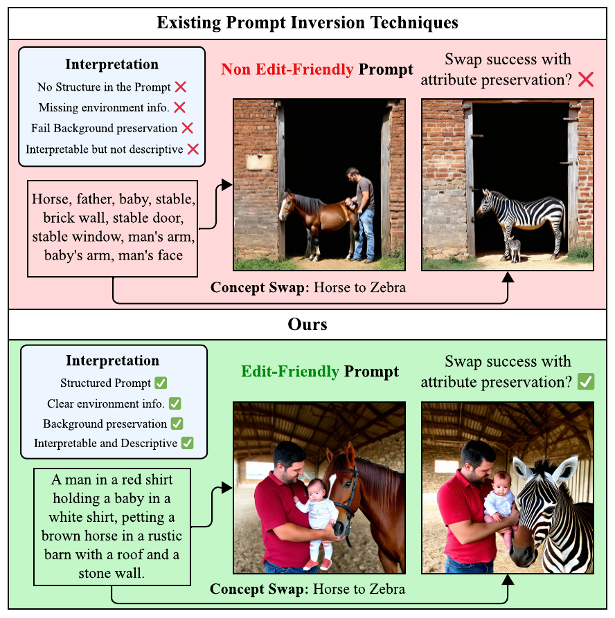
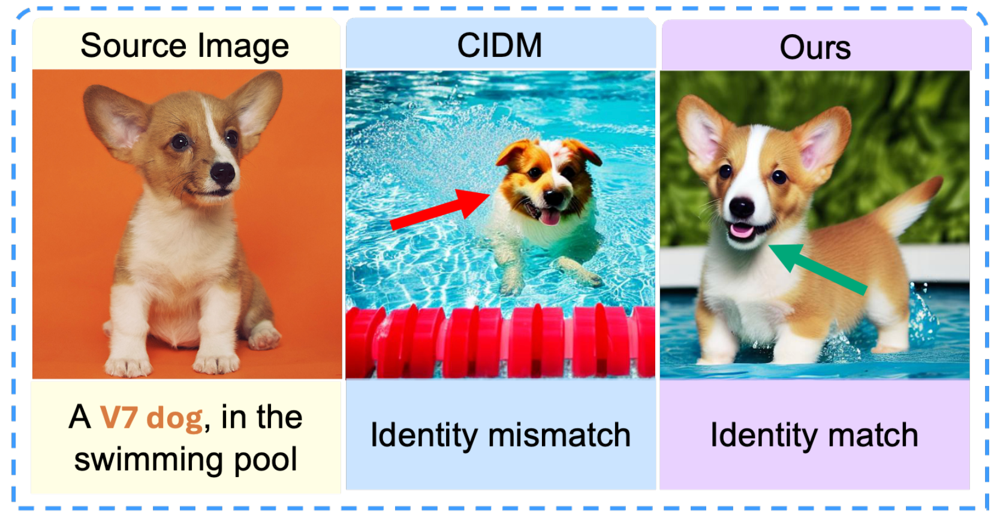
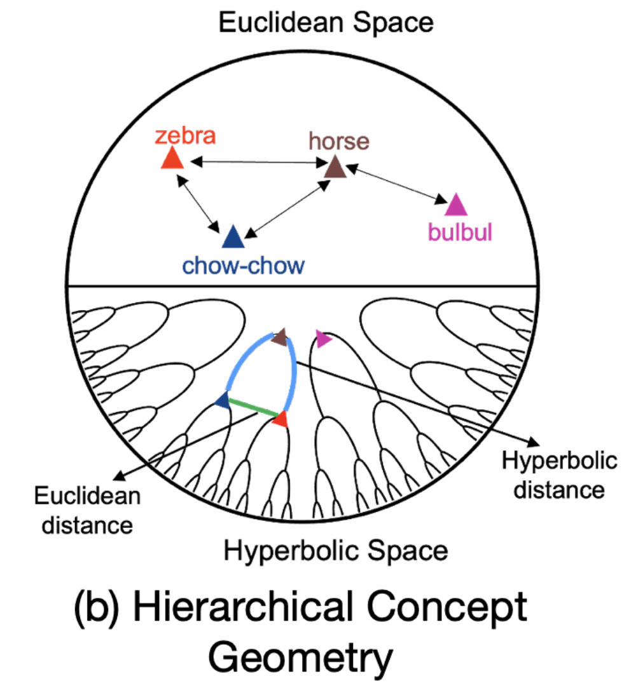
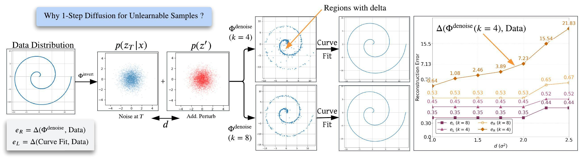
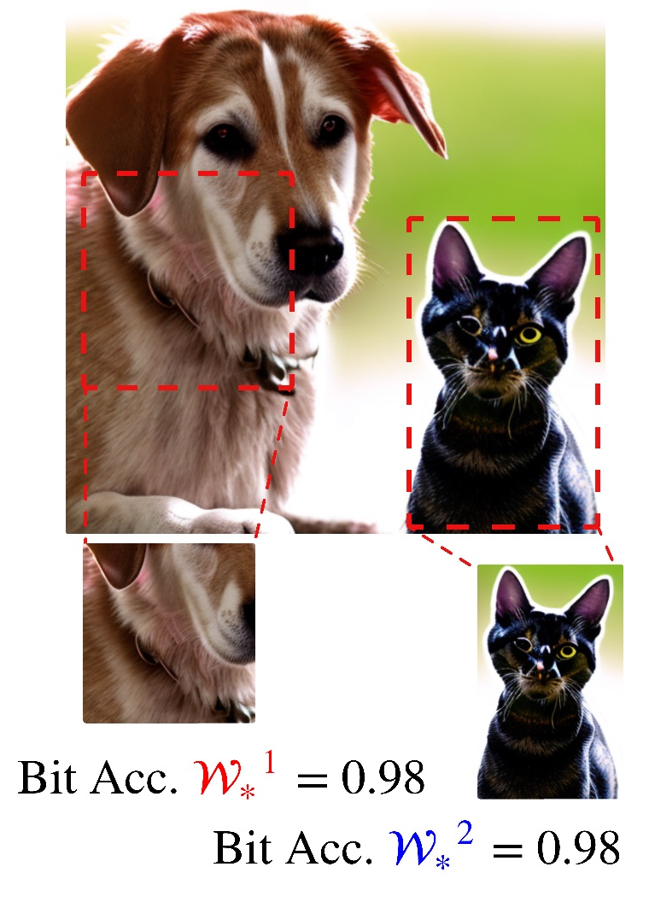
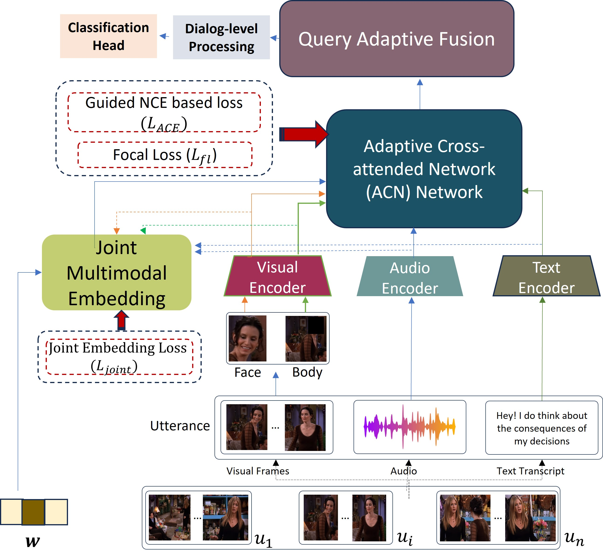
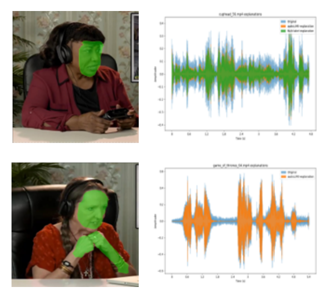
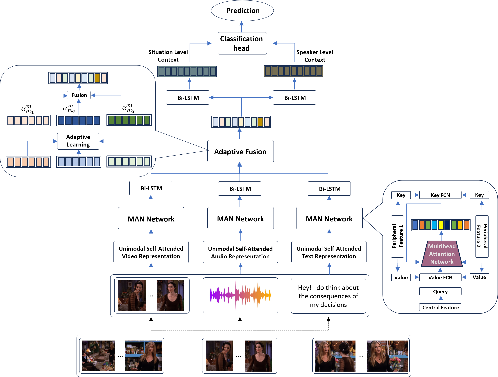

# 📃 Publications

  <a href="./intro.html">About Me</a>
  <a href="./publications.html">Publications</a>
  <a href="./intro.html#my-teaching">My Teaching</a>
  <!-- <a href="./research_notes/intro.html">Research Notes</a> -->

___

* - Corresponding Author(s).

  
  

    

    <a href="">
    Interpretable Prompts made Edit-Friendly: Token-to-Token Similarity Reduction in dLLMs for Edit-Friendly Hard Prompt Inversion
    </a>
    

    

    <b>Naresh Kumar Devulapally</b>*, Shruti Agarwal, Vishal Asnani, Vishnu Suresh Lokhande* 

    
<i>The IEEE/CVF Conference on Computer Vision and Pattern Recognition (<b>CVPR 2026</b>)</i>

    

      <a href="">Paper (Soon)</a>
      <a href="https://github.com/naresh-ub">Code (Soon)</a>
      <a href="https://slides.com/naresh-ub/prompt-inversion-llada">Slides</a>
      <a href="">Poster (To Appear)</a>
      <!-- <a href="#">Video</a> -->
    

  

  
  

    

    <a href="">
      Forget Less by Learning Together through Concept Consolidation
    </a>
    

    

    Arjun Ramesh Kaushik*, <b>Naresh Kumar Devulapally</b>, Vishnu Suresh Lokhande, Nalini Ratha, Venugopal Govindaraju 

    
<i>The IEEE/CVF Winter Conference on Applications of Computer Vision (<b>WACV 2026</b>)</i>

    

      <a href="">Paper (Soon) </a>
      <a href="">Code (Soon)</a>
      <!-- <a href="#">Video</a> -->
    

  

  
  

    

    <a href="">
      Forget Less by Learning from Parents Through Hierarchical Relationships
    </a>
    

    

    Arjun Ramesh Kaushik*, <b>Naresh Kumar Devulapally</b>, Vishnu Suresh Lokhande, Nalini Ratha, Venugopal Govindaraju 

    
<i>The 40th Annual AAAI Conference on Artificial Intelligence (<b>AAAI 2026</b>)</i>

    

      <a href="">Paper (Soon) </a>
      <a href="">Code (Soon)</a>
      <!-- <a href="#">Video</a> -->
    

  

  
  

    

    <a href="https://dl.acm.org/doi/10.1145/3746027.3755112">
      Latent Diffusion Unlearning: Protecting against Unauthorized Personalization through Trajectory Shifted Perturbations
    </a>
    

    

    <b>Naresh Kumar Devulapally</b>*, Shruti Agarwal, Tejas Gokhale, Vishnu Suresh Lokhande* 

    
<i>33rd ACM International Conference on Multimedia (<b>ACM MM 2025</b>)</i>

    

      <a href="https://dl.acm.org/doi/10.1145/3746027.3755112">Paper</a>
      <a href="https://github.com/naresh-ub">Code</a>
      <a href="https://slides.com/naresh-ub/unlearnable-samples">Slides</a>
      <!-- <a href="https://github.com/naresh-ub">Code (Soon) </a> -->
      <!-- <a href="#">Video</a> -->
    

  

  
  

    

    <a href="https://openaccess.thecvf.com/content/ICCV2025/html/Devulapally_Your_Text_Encoder_Can_Be_An_Object-Level_Watermarking_Controller_ICCV_2025_paper.html">
      Your Text Encoder Can Be An Object-Level Watermarking Controller
    </a>
    

    

    <b>Naresh Kumar Devulapally</b>*, Mingzhen Huang, Vishal Asnani, Shruti Agarwal, Siwei Lyu, Vishnu Suresh Lokhande* 

    
<i>IEEE/CVF International Conference on Computer Vision (<b>ICCV 2025</b>)</i>

    

      <a href="https://openaccess.thecvf.com/content/ICCV2025/html/Devulapally_Your_Text_Encoder_Can_Be_An_Object-Level_Watermarking_Controller_ICCV_2025_paper.html">Paper</a>
      <a href="https://github.com/naresh-ub">Code</a>
      <a href="https://slides.com/naresh-ub/umbc-talk-watermarking">Slides</a>
      <a href="https://iccv.thecvf.com/media/PosterPDFs/ICCV%202025/1870.png?t=1759981503.377534">Poster</a>
      <!-- <a href="#">Video</a> -->
    

  

  
  

    

    <a href="https://arxiv.org/abs/2402.10921">
      Adaptive Missing-Modality Emotion Recognition in Conversations via Joint Embedding Learning
    </a>
    

    

    <b>Naresh Kumar Devulapally</b>*, Sidharth Anand, Sreyasee Das Bhattacharjee, Junsong Yuan 

    
<i><b>ICME 2024</b></i>

    

      <a href="https://arxiv.org/abs/2402.10921">Paper</a>
      <a href="https://github.com/neuralnaresh/multimodal-emotion-recognition">Code</a>
      <!-- <a href="#">Video</a> -->
    

  

  
  

    

    <a href="https://dl.acm.org/doi/10.1145/3581783.3612517">
      Multi-label Emotion Analysis in Conversation via Multimodal Knowledge Distillation
    </a>
    

    

    <b>Naresh Kumar Devulapally</b>*, Sidharth Anand, Sreyasee Das Bhattacharjee, Junsong Yuan 

    
<i>31st ACM International Conference on Multimedia (<b>ACM MM 2023</b>)</i>

    

      <a href="https://dl.acm.org/doi/10.1145/3581783.3612517">Paper</a>
      <a href="https://github.com/neuralnaresh/multimodal-emotion-recognition">Code</a>
      <!-- <a href="#">Video</a> -->
    

  

  
  

    

    <a href="https://ieeexplore.ieee.org/abstract/document/10411802">
      AMuSE: Adaptive Multimodal Analysis for Speaker Emotion Recognition in Group Conversations
    </a>
    

    

    <b>Naresh Kumar Devulapally</b>*, Sidharth Anand, Sreyasee Das Bhattacharjee, Junsong Yuan 

    
<i><b>BigMM 2023</b></i>

    

      <a href="https://ieeexplore.ieee.org/abstract/document/10411802">Paper</a>
      <a href="https://github.com/neuralnaresh/multimodal-emotion-recognition">Code</a>
      <!-- <a href="#">Video</a> -->
    

  

